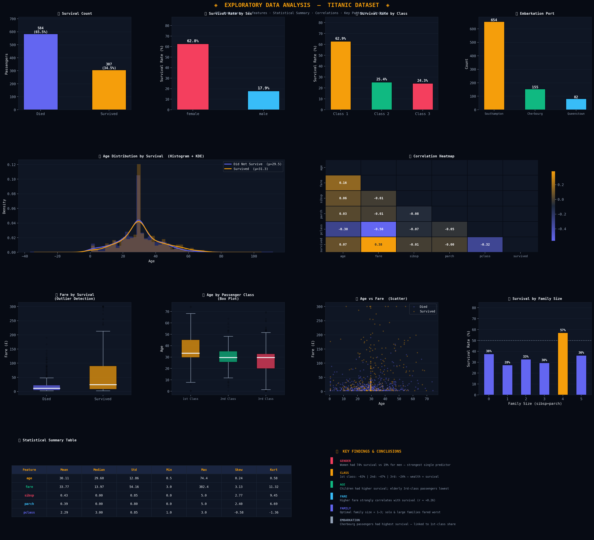

# 🚢 Exploratory Data Analysis — Titanic Dataset

A single-script Python EDA that synthetically reconstructs the classic Titanic passenger dataset, performs statistical analysis, and produces a publication-ready 12-chart dashboard.



---

## 📋 Overview

This project simulates 891 Titanic passengers with realistic survival probabilities based on gender, class, age, fare, family size, and embarkation port. It then runs a full exploratory analysis and renders all findings in one dark-themed visual report.

---

## 📊 What's Analysed

| # | Chart | Insight |
|---|-------|---------|
| ① | Survival Count | 65.5% died, 34.5% survived |
| ② | Survival Rate by Sex | Women ~63%, Men ~18% |
| ③ | Survival Rate by Class | 1st ~63%, 2nd ~25%, 3rd ~24% |
| ④ | Embarkation Port | Southampton dominant (654 passengers) |
| ⑤ | Age Distribution (Histogram + KDE) | Survivors slightly older on average |
| ⑥ | Correlation Heatmap | Fare (+), Pclass (−) strongest correlates |
| ⑦ | Fare by Survival (Box Plot) | Survivors paid significantly higher fares |
| ⑧ | Age by Passenger Class (Box Plot) | 1st class passengers older on average |
| ⑨ | Age vs Fare (Scatter) | Higher fare = higher survival at all ages |
| ⑩ | Survival by Family Size | Family size 4 peaks at 57%; solo lowest |
| ⑪ | Statistical Summary Table | Mean, Median, Std, Skew, Kurtosis |
| ⑫ | Key Findings Panel | Narrative conclusions |

---

## 🔑 Key Findings

- **Gender** is the strongest single predictor — women survived at ~74% vs ~19% for men.
- **Passenger class** reflects a clear socioeconomic bias: 1st class >> 3rd class survival.
- **Fare** correlates positively with survival (r ≈ +0.26), largely as a proxy for class.
- **Age** has a moderate effect — children were prioritised; elderly 3rd-class passengers fared worst.
- **Family size** of 1–3 was optimal; solo travellers and large families (4+) had below-average survival.
- **Embarkation port** (Cherbourg) shows higher survival, linked to its higher share of 1st-class passengers.

---

## 🛠 Requirements

```bash
pip install pandas numpy matplotlib seaborn
```

| Library | Purpose |
|---------|---------|
| `pandas` | Data manipulation & statistics |
| `numpy` | Synthetic data generation |
| `matplotlib` | Chart rendering & layout |
| `seaborn` | Correlation heatmap |

Python 3.8+ recommended.

---

## 🚀 Usage

```bash
python eda_titanic.py
```

The script will:
1. Print a dataset overview (shape, missing values, dtypes) to the console
2. Print a statistical summary table
3. Print correlation values with `survived`
4. Save the 12-chart dashboard as **`eda_titanic_report.png`** in the working directory
5. Print a formatted conclusions summary to the console

---

## 📁 Project Structure

```
titanic-eda/
├── eda_titanic.py          # Main analysis script
├── eda_titanic_report.png  # Output dashboard (generated on run)
└── README.md
```

---

## 📝 Notes

- The dataset is **synthetically generated** using NumPy with survival probabilities calibrated to match real Titanic statistics. It is not the original Kaggle dataset.
- Missing values are intentionally injected (177 in `age`, 2 in `embarked`) and imputed with median/mode to simulate a realistic data-cleaning step.
- The random seed is fixed at `42` for reproducibility.

---

## 📄 License

This project is open source and available under the [MIT License](LICENSE).
